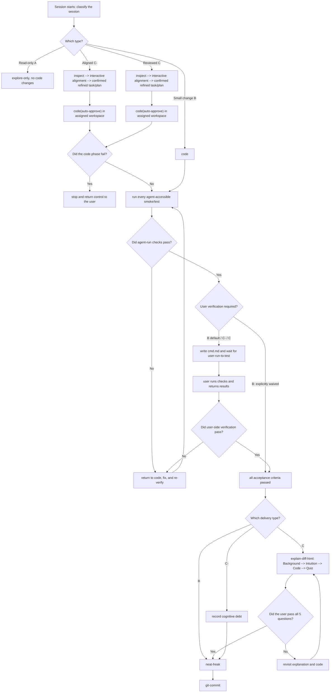

<!-- init-repo-agents:managed:begin -->

# vla-post-train · Agent Collaboration Guide

> Private VLA/VTLA post-training research workspace for method repositories, reproducible experiments, run evidence, and agent workflows.

**Primary toolchain:** Python 3.12 + uv + ruff + ty + pytest; method-specific training environments remain isolated

This file defines the behavioral baseline for agents working in this repository. The core principle is: **align before acting, and collaborate instead of making unilateral assumptions.** Clear context alignment with the user is a prerequisite for writing code.

---

## 0. Session Lifecycle (Highest-Level Constraint)

**At the start of every session, the agent must explicitly classify and state the session type** before following the corresponding lifecycle. Do not skip this classification.

**The execution environment is an input to the session.** The current branch, worktree, or other isolated environment is selected by the user or external scheduler before the session starts. The lifecycle below describes one session only. It must not decide how many tasks run in parallel or create or switch workspaces on its own. Unless the user explicitly changes the assignment, stay inside the provided workspace.

- **Type A · Read-only exploration** (`explore-only`): answer questions and investigate without changing code. Gather context in read-only mode and do not enter the coding lifecycle.
- **Type B · Small code change** (`small code`): the change is small, intent is already clear, and no meaningful behavioral or design fork exists. Skip alignment and understanding review; follow `code → agent verify → user verify by default → neat-freak → git-commit`.
- **Type C− · Aligned delivery** (`aligned code`): the initial request is not precise enough to execute safely, so human intent alignment is mandatory before coding, but immediate human code-understanding review is not required. Follow `align → code → agent verify → user verify → record cognitive debt → neat-freak → git-commit`.
- **Type C · Reviewed delivery** (`reviewed code`): human intent alignment is mandatory before coding and human understanding must be current before delivery. Follow the full lifecycle through Explain Diff and its five-question quiz.



**Classification rules:**

- Use Type B only when the request is genuinely small and already leaves no meaningful intent, behavior, or design question unanswered.
- Use Type C− when coding requires clarification of the user's intent or preferences, but the user accepts deferring code-understanding review.
- Use Type C for architectural, irreversible, high-ownership, or otherwise substantial work whose human understanding must be current at delivery.
- When uncertain between B and C−, choose C−. When uncertain between C− and C, choose C.

**Type C− / C failure handling:** after alignment, the `code` phase may proceed with auto-approval, but repeated failures or renewed uncertainty about intent require an immediate stop. Return control to the user instead of gambling on another change (see Section 3).

---

## 1. Timing · What to Do When

- **At session start:** determine whether this is a new task or a continuation. For a continuation, read `docs/plan.md` and `docs/log.md` first to recover prior progress and reasoning.
- **Before a Type C− or Type C task starts:** complete the Alignment Gate in Section 2. Type B skips it only because its intent is already unambiguous.
- **After candidate code is written:** enter the verification gate below. Implementation is complete at this point; the task is not.
- **After verification passes:** Type B proceeds to `neat-freak`; Type C− records cognitive debt and proceeds to `neat-freak`; Type C enters the Understanding Gate.
- **After the required gates pass:** run `neat-freak` at task completion or a milestone to reconcile code, documentation (`docs/`, `README.md`), and memory. Do not spend time synchronizing documentation for code that may not work.
- **After each task passes its required gates:** prepend an entry to `docs/log.md`. For Type C−, label the entry and link its open cognitive-debt record.

### Verification Gate (Between Code and Wrap-Up)

1. Before coding, use `karpathy-guidelines` to define observable acceptance criteria. After coding, derive the required checks from those criteria rather than relying on "looks correct."
2. Run an appropriate combination of lint, typecheck, unit tests, and smoke tests wherever the agent can access the required environment. Preserve results that can be reviewed.
3. **User-run verification is part of delivery.** It is mandatory for Type C− and Type C, and the default for Type B unless the user explicitly waives it. Update the pending-verification section in root `cmd.md` with prerequisites, copyable commands, pass criteria, and the evidence to return on failure. Then stop and wait for the user to run it and confirm the observed result.
4. Any failed required check returns the task to `code`, followed by the full verification gate again. Do not reuse results invalidated by a fix.
5. Only after agent checks and every required user-run check pass may work enter its type-specific closeout. During verification, update only the `cmd.md` content required for testing; do not begin broad documentation synchronization.
6. **Commit only the session patch:** stage and commit solely the hunks that implement or document the current session's verified task. Do not include pre-existing changes, unrelated files, drive-by cleanup, or any other work outside the session's scope. Inspect the staged diff before committing; if the intended patch cannot be isolated safely, stop and ask the user.

### Understanding Gate (Between Verification and Wrap-Up)

For Type C work, use `explain-diff-html` after verification and before `neat-freak` or
`git-commit`.

1. Generate the explanation in execution order with Background, Intuition, Code
   walkthrough, and five medium-difficulty multiple-choice questions.
2. The human must read the explanation and explicitly report passing all five
   questions. Generating the artifact is not a pass.
3. A wrong answer returns the human to the relevant explanation and code; keep the
   gate closed until they pass.
4. The gate exists to preserve the human's ability to participate in later design,
   not merely to duplicate test verification.

Type C− deliberately defers this Understanding Gate. Before its commit, append an
Open entry to `docs/cognitive-debt.md` with the change scope, reason review was
deferred, verification evidence, concepts not yet understood, and repayment
criteria. The later repayment must run `explain-diff-html` against the recorded
commit or diff, pass all five questions, mark the entry Repaid, and commit that
closeout. Type C− defers understanding, never verification.

## 2. Alignment · Prerequisite for Coding (Embedded Grill Workflow)

This is the most important rule for Type C− and Type C. **The user's first prompt
is an initial task draft, not permission to fill its gaps with agent assumptions.**
Never hide uncertainty, rely on guesses, or start implementation while the user's
intent is unclear. Follow Inspect → Grill → Distill → Confirm → Execute. Do not
write code until the user confirms the refined task or plan.

**Inspect**
- Read the relevant code and project documentation first.
- Use the repository to establish current behavior and constraints. Repository
  evidence can answer factual questions; it cannot decide the user's unstated
  preferences, goals, trade-offs, or desired behavior.

**Grill**
- Ask the smallest useful set of related questions, then iterate for as many rounds
  as needed. Questions may be asked individually or in a batch; do not serialize
  questions mechanically when one user response can resolve a related group.
- Incorporate everything the user answers and do not re-ask resolved questions.
- State the uncertainty and available choices before giving a recommended answer
  and a one-sentence reason.
- Investigate facts that can be answered from code or documentation instead of
  asking the user, but never treat code as evidence of user intent.
- When terminology is ambiguous or overloaded, propose one canonical term before continuing (for example: "Does `env` mean the Conda environment or the simulation environment? Choose one.").
- Use concrete scenarios to make unclear relationships or boundaries precise.
- Cross-check the user's description of system behavior against the code and surface contradictions immediately.

**Distill**
- Once discussion converges, present a Refined Task or Plan containing the goal,
  current context, expected behavior, in-scope work, explicit non-goals, user
  preferences, constraints and trade-offs, acceptance criteria, implementation
  outline, and remaining open questions.
- Scale the artifact to the change: Type C− may use a short plan; Type C may need a
  detailed Plan Mode artifact and several review rounds.
- Persist only durable outcomes after confirmation:
  - **Glossary:** canonical terms in the form `term — definition`, without implementation details.
  - **Decisions:** difficult-to-reverse choices in the form `choice · alternatives · rationale`.
- Record a decision only when it is difficult to reverse, surprising without context, and the result of a real trade-off. Skip it unless all three conditions hold.

**Confirm**
- Stop and ask the user to confirm the Refined Task or Plan.
- Do not treat silence, lack of objection, or the agent's own confidence as
  confirmation.
- Any correction reopens alignment; update the artifact and ask again.

**Execute**
- Only after explicit confirmation begin implementation, following the agreed
  refined task and plan.

Follow `karpathy-guidelines`: make the smallest surgical change, avoid speculative design, state assumptions explicitly, and define verifiable success criteria.

## 3. Exceptions · Know When to Stop

When the available context is insufficient for a sound decision, **stop and return control to the user** instead of guessing.

Signals that the agent is stuck include repeating the same failed action, uncertainty about the user's actual intent, approaching an irreversible or destructive operation, or making no progress after multiple attempts.

## 4. Collaboration · Finding Context When a Problem Is Not Immediately Solvable

An agent does not inherently know the details of a specific codebase. When a problem cannot be solved directly, find enough relevant context in this order:

1. **Documentation details** → use `ctx7` / `find-docs` for current library, framework, and API documentation, even for familiar technology.
2. **Unusual bugs** → search online and use `gh` (`gh-cli`) to inspect relevant repository issues.
3. **Still unclear** → ask the user for missing context or stop and return the decision to them.

Base decisions on evidence rather than guesses.

## 5. Documentation · `docs/` Is Shared Project Context

Do not rely excessively on Git history. Maintain readable project context in `docs/` so future sessions can resume quickly and the project can move across machines and agents without depending on CLI-specific global memory. Maintain:

- `docs/plan.md` — the forward-looking plan shared by the user and agent.
- `docs/log.md` — verified completed tasks, with the newest entry first.
- `docs/bug.md` — reusable lessons about unusual bugs, including triggers, fixes, and causes.
- `docs/cognitive-debt.md` — explicitly deferred human understanding, with evidence and repayment status.
- `docs/<module>.md` — module-level responsibilities and boundaries, indexed below.

### Code Documentation Index

Fill module documentation **incrementally**. Create `docs/<module>.md` the first time a module is explored deeply; afterward, read the documentation first to avoid repeatedly rediscovering the code.

<!-- init-repo-agents:module-index:begin -->
- [[docs/dsrl-pi0.md]] — dsrl-pi0 module (`methods/dsrl-pi0/`)
- [[docs/expo-ft.md]] — expo-ft module (`methods/expo-ft/`)
- [[docs/flowdagger.md]] — flowdagger module (`methods/flowdagger/`)
- [[docs/lerobot.md]] — lerobot module (`methods/lerobot/`)
- [[docs/n0-vtla.md]] — n0-vtla module (`methods/n0-vtla/`)
- [[docs/rlinf.md]] — rlinf module (`methods/rlinf/`)
- [[docs/starvla.md]] — starvla module (`methods/starvla/`)
- [[docs/univtac.md]] — univtac module (`methods/univtac/`)
<!-- init-repo-agents:module-index:end -->
<!-- Seeded from a shallow structural scan during initialization, for example:
- [[docs/datasets.md]] — dataset loading and metadata (`src/<pkg>/datasets/`)
- [[docs/policies.md]] — policy models (`src/<pkg>/policies/`)
Keep unwritten entries as placeholders and fill them when the module is explored. -->

## 6. Command Interfaces · Reduce Manual Command Entry

Consolidate common development commands and complex experiment configuration behind reusable interfaces so neither the user nor the agent must repeatedly reconstruct long commands.

### 6.1 `dev.sh` · Unified Project Entry Point

- **`lab` (conventionally `dev.sh`)** wraps common development and launch commands: environment setup, lint, format, typecheck, tests, training, inference, evaluation, and data processing. Expose them as subcommands such as `./dev.sh train`, `./dev.sh eval`, and `./dev.sh lint`.
- When a workflow becomes common, add a `dev.sh` subcommand instead of asking the user to remember a raw command.
- Keep `dev.sh` focused on orchestration: compose commands, load configuration, and pass arguments while implementation remains in the appropriate scripts or entry points.

### 6.2 Complex Parameters · YAML-Driven Experiments

- Put complex experiment parameters in YAML files such as `experiments/<exp_name>.yaml` instead of long command lines. Each experiment file is a complete reproducible configuration.
- Let `dev.sh` options override YAML values, for example: `./dev.sh train --config experiments/foo.yaml --override lr=1e-4`. Baselines remain in YAML while temporary tuning uses options.
- This keeps experiments reproducible, reduces tuning overhead, and lets agents inspect and modify experiment configuration directly.

### 6.3 `cmd.md` · Command Reference

- Root `cmd.md` contains copyable commands for the user, including `dev.sh` examples and typical experiment launches.
- When required verification can only be performed by the user, add or update one pending-verification block. Render it in the user-facing documentation language defined in Section 8 and include these semantic fields:

```markdown
## Pending User Verification
- **Status:** Pending
- **Purpose:** <what this change must prove>
- **Prerequisites:** <required device, environment, data, or service>
- **Commands:** `<copyable commands in execution order>`
- **Pass criteria:** <observable and unambiguous success>
- **Return on failure:** <logs, output, screenshots, or device behavior>
```

- When the user returns results, either mark verification as passed or return to code. Delivering commands is not equivalent to passing verification.

## 7. Code Standards

- **Modern Python projects:** follow `modern-python` conventions, including uv, ruff, and ty.
- **Docstrings:** use Google-style docstrings.
- **Comment granularity:** use one short section comment per coherent block when explanation is useful.
- **Comment intent:** explain why the block exists, not what each statement does. Do not write noise such as `# Import modules`.

## 8. Language Conventions

- **Agent-facing repository instructions:** write `AGENTS.md` and its mirrored `CLAUDE.md` in English.
- **Code comments:** write in English.
- **User-facing documentation:** write `docs/`, `README.md`, and `cmd.md` in Chinese.
- **Agent-only material:** write system prompts, internal plans, and internal notes in English.
<!-- init-repo-agents:managed:end -->

# VLA Post-Training Workspace Rules

- Keep this repository as the orchestration and evidence layer. Algorithm, framework, benchmark, and reproduction code belongs in independent `methods/*` submodules.
- Before changing a method, read `methods/<method>/AGENTS.md`. Before running it, also read `experiments/<method>/runbook.md`.
- Formal runs require a clean method checkout, a committed root config, and root and method commits that are available from their remotes.
- Dirty checkouts are permitted only for explicitly marked smoke or debugging runs and must never support a formal algorithmic conclusion.
- Store checkpoints, datasets, videos, complete logs, rollout data, W&B caches, and other large artifacts under `/mnt/data/atticux/vla-post-train/`.
- Treat local exit codes and tracebacks as authoritative when they disagree with a tracking service status.
- A smoke run proves only the engineering path. Single-task, single-seed, or low-episode evidence must be reported with its scope.
- Archive both successful and failed runs with traceable configuration and code evidence.
- Put deterministic reusable mechanics in `scripts/`. Add a repository-local Skill only after the agent workflow is stable and reusable.
- Use a user-controlled fork as `origin` and the official repository as `upstream`. Use a private mirror for unpublished changes that must not enter a public fork.
- Keep method-level Agent files method-specific. Do not copy this root managed block into a submodule; use a short `CLAUDE.md` pointer or symlink to the method's `AGENTS.md`.
