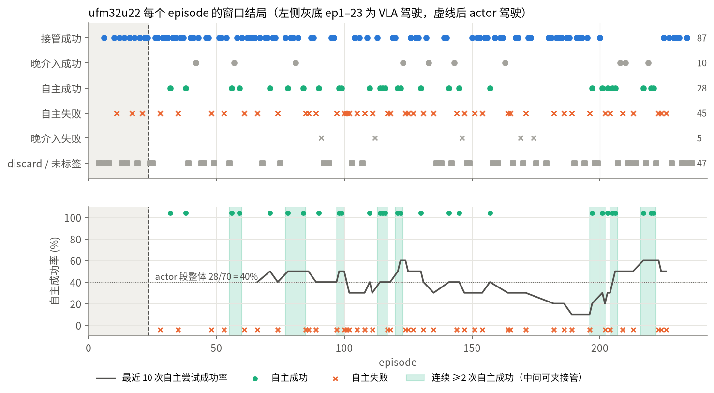
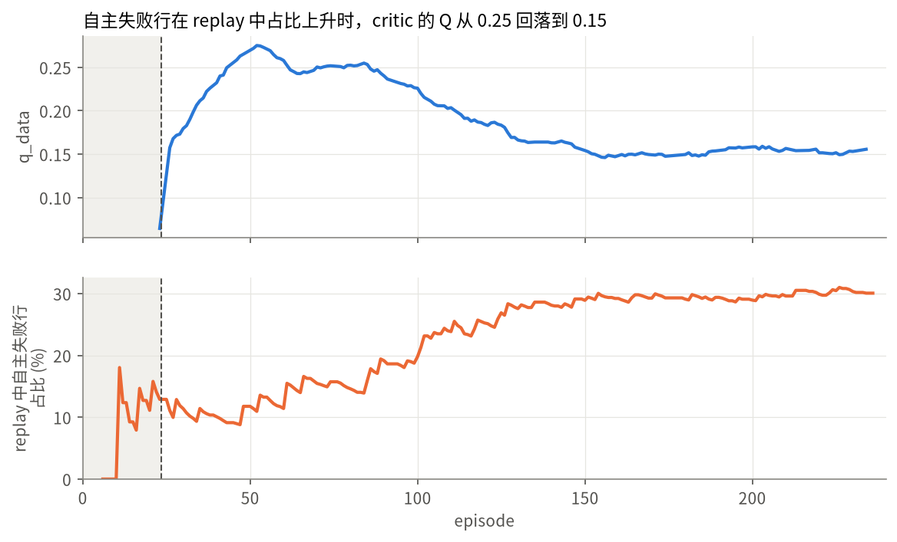
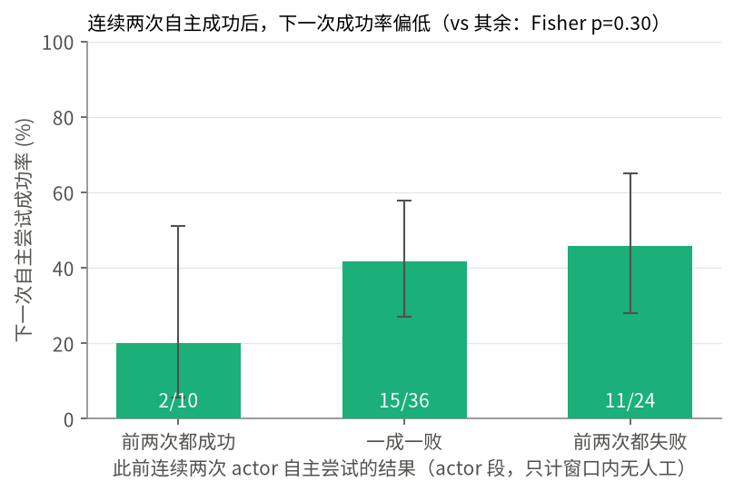
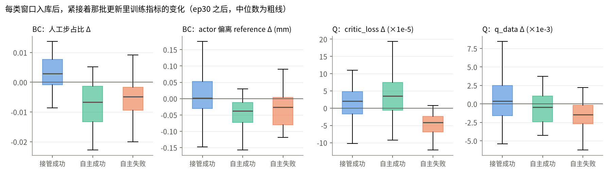
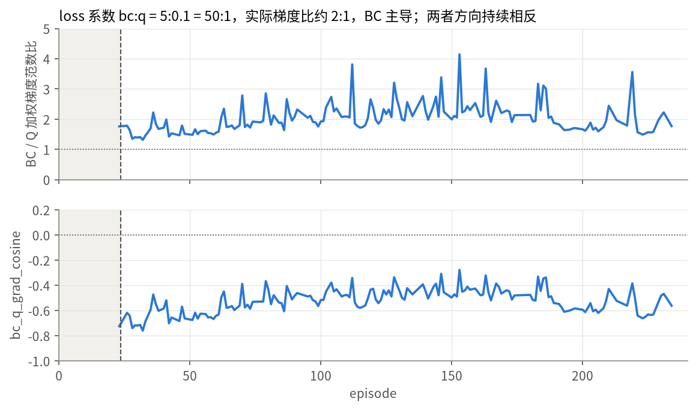
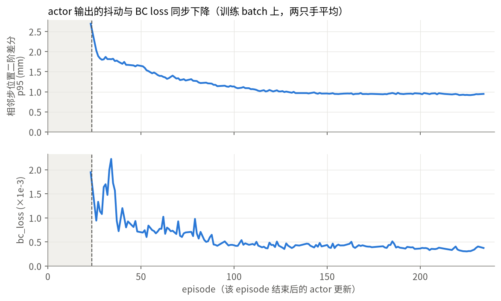

# TacXense 实验记录

本文件按时间倒序记录 TacXense 的 RLT 实验。每次实验三部分：**原始记录**（配置与直接观测，不含
解释）、**结果分析**（从观测推出的结论，区分已验证与猜想）、**下一步**（未确认的候选调整，
`- [ ]` 表示尚未验证）。第三部分里的条目经确认后才搬进 `plan.md` 成为事务。

RLT 的两阶段架构、contract 与字段含义见 [rlt.md](rlt.md)，本文件不重复。

---

## 2026-09-24 · rlt_fast/0924-test（`ufm32u22`）— 固定环境后重跑，接管只录空中纠偏

同一天第二次从头开始的 run，沿用 `exp_name=0924-test`。执行上一节 §3.1 的"控制现场"：尽量固定环境。
采集规程也按用户的新做法收紧，见下方"采集规程"。算法与代码都没有改。

### 1 原始记录

**W&B**：<https://wandb.ai/atticux/tacxense-rlt/runs/ufm32u22>
（project `atticux/tacxense-rlt`，run `ufm32u22`，group `rlt_fast/0924-test`）。同 group 在它之前还有
4 个启动即失败的 run（`my5a5s17`、`z82y59rp`、`evu01ofa`，以及 `0924-test-02` 的 `7277b9l2`），都没有 episode，不计入。
本节统计与图都来自推理机 `02-xense-inference` 上的本地记录
`~/TacXense/wandb/run-20260924_141642-ufm32u22/run-ufm32u22.wandb`，与 W&B 上的数据一致且完整。

**代码版本**：`methods/tacxense` @ `8de5970`（`chore(rlt): lower rlt_fast warm_up to 250`），与上一节相同；
主机 `xense-5090d`，命令 `train_rl.py --config rlt_fast --exp-name 0924-test`，`resume=false`。

**任务与权重**：与上一节相同，本节不重复。

**收束状态**：run state `finished`，wall 6330 s，共 236 个 episode，全部统计基于这 236 个。

**采集规程（用户说明）**：
- 只针对失败模式接管：网口在空中、快靠近插孔时接管，把偏移纠正到位，再轻轻插入一点点就结束录制。
  完整的插入过程不录，用户发现录进去会让能力变差。
- 前期大致按"2 次接管、1 次自主尝试"的比例采集。
- actor 自主尝试里"乱试后才成功"的数据不进 replay，做 discard 处理。
- 不允许撞上去后再试探着插：插头一撞就容易滑移，这个任务做不到。
- 环境已尽量固定，但仍容易漂移。

#### 影响训练的配置

W&B config 与上一节（`hieo8h57`）逐字段 diff **完全一致**，`warm_up=250`，其余同 0922。

#### 成功率

窗口按"窗口内人工"分三类：
- **自主**：窗口内人工步为 0；
- **接管**：开窗后第一个 chunk 就有人工；
- **晚介入**：第一个 chunk 由 actor 驾驶，之后才出现人工（人工步 1–66，中位 11）。

| 类别 | 成功标签 | 失败标签 | discard | dropped | 合计 |
|---|---|---|---|---|---|
| 自主 | 28 | 45 | 10 | 1 | 84 |
| 晚介入 | 10 | 5 | 3 | 9 | 27 |
| 接管 | 87 | 0 | 17 | 7 | 111 |

另有 14 个 episode 未开窗。actor 从 ep24 开始驾驶（replay 在 ep23 过 250：234→256）。
自主窗口的 discard 长 96–184 步，都是长时间乱试的尝试；有标签的自主窗口里，成功平均 59 步，失败平均 77 步。

**自主成功率分阶段**（"有标签" = 成功 /（成功 + 失败）；"含 discard" = 成功 / 全部自主窗口）：

| 段 | 自主窗口 | 成功 / 失败 / discard | 有标签 | 含 discard |
|---|---|---|---|---|
| ep1–23（VLA 驾驶） | 3 | 0 / 3 / 0 | 0/3 | 0/3 |
| ep24–60 | 8 | 4 / 4 / 0 | 50.0% | 50.0% |
| ep61–100 | 14 | 6 / 8 / 0 | 42.9% | 42.9% |
| ep101–140 | 19 | 7 / 12 / 0 | 36.8% | 36.8% |
| ep141–180 | 14 | 3 / 7 / 3（+1 dropped） | 30.0% | 21.4% |
| ep181–236 | 26 | 8 / 11 / 7 | 42.1% | 30.8% |
| **actor 段合计 ep24–236** | 81 | 28 / 42 / 10（+1） | **28/70 = 40.0%** | 28/81 = 34.6% |

actor 段有标签的自主尝试 `corr(episode index, success) = −0.022`（p=0.85，n=70）；
ep24–130 vs ep131–236 为 17/39 vs 11/31，Fisher p=0.62。

按图中两段细分：ep158–196 自主 0/7（另 2 个 discard），同期接管成功 18 次；ep197–236 自主 8/15，
接管成功 7 次。两段自主成功率 Fisher p=0.022。

晚介入窗口的 10 个成功标签里，9 个的人工步只有 2–11 步。晚介入通常是在快插入时由人接管插进去，
只要窗口内有人工就算 intervention，不计入 actor 自主尝试。

接管成功窗口平均 63 步，其中人工步占 67%；有 24 个在开窗前就已接管（先握持，再按 b）。
自主窗口数按段为 3 / 8 / 14 / 19 / 14 / 26，后段自主尝试的比例高于前段。

#### 训练与执行观测

*节奏*：ep23 一次跑了 1280 次 critic 更新。最终 replay 4241 行（未到 6000），其中 2002 行（47.2%）含人工步；
`update_step` 21205、`actor_update_step` 10602；175 个入库关键阶段，每阶段 66.3 步、24.2 行；
episode wall 中位 22.3 s。replay 按窗口类别分：自主失败 1275 行、自主成功 578 行、晚介入 406 行、接管成功 1982 行。

*Q 与 critic*（首尾各 1000 次 critic 更新）：

| 指标 | 首 1k | 末 1k |
|---|---|---|
| `q_data` / `q_target` | 0.0426 / 0.0427 | 0.152 / 0.152 |
| `critic_loss` | 1.20e-3 | 8.1e-5 |
| `q_disagreement` | 9.5e-3 | 6.6e-3 |
| `q_target_std` | 0.185 | 0.175 |

`q_data` 的走势不是单调的：约 ep52 升到峰值 0.275，之后随自主失败行累积降到 0.15 并走平（约 ep150 以后）。
`terminal_ratio` 为 0.047 → 0.042。

*Actor 与梯度*（首尾各 1000 次 actor 更新）：

| 指标 | 首 1k | 末 1k |
|---|---|---|
| `q_pi` / 同批 `q_data` | 0.1043 / 0.1017 | 0.1522 / 0.1526 |
| `actor_grad_norm` | 0.100 | 0.0181 |
| `weighted_bc_grad_norm` / `weighted_q_grad_norm` | 0.136 / 0.079 | 0.0215 / 0.0111 |
| `bc_q_grad_cosine` | −0.705 | −0.553 |
| `bc_loss` | 1.69e-3 | 3.5e-4 |
| `actor_output/residual_position_mm_mean` | 1.71 | 0.91 |
| `human_mask_ratio` | 0.666 | 0.349 |

末 1k 加权梯度比 bc/q = 1.93；`bc_q_grad_cosine` 在 99.93% 的 actor 更新里为负。

*Actor 输出平滑度*：训练 batch 上 actor 输出的相邻步位置二阶差分 p95（`update/position_*_second_diff_p95`，
`td.py:232-244`，解码到执行空间后计算，两只手平均），ep24 后首批更新约 2.7mm，ep30 降到约 1.8mm，约 ep100 降到 1.0mm 后走平。

*Actor 输出残差（fresh decision）*：actor 实际驾驶 647 chunk，position 均值 2.98mm、最大 66.0mm，
rotation 0.0110 rad，gripper 0.040；shadow 3581 chunk，均值 18.9mm、最大 153.0mm。
分段（ep1–60 / 61–100 / 101–140 / 141–180 / 181–236）：actor 驾驶 4.95 / 3.56 / 2.72 / 2.28 / 2.46mm，
shadow 26.1 / 17.2 / 16.6 / 15.9 / 15.8mm。

*工程健康度*：nonfinite、rot6d fallback 全程 0；`actor_requested_chunks == actor_chunks`（236/236）。
`codec_out_of_range` 每 chunk 7.56（1.9%）；`feature_ms` 中位 162ms、p95 170ms、max 344ms；
`execution_s` 中位 0.677 s、max 4.61 s。236 个 episode、105 分钟一次跑完，中途没有崩溃。

---

### 2 结果分析

#### 2.1 已验证：base policy 插不进，actor 学会了纠正偏移

**（用户真机观察，已核实）** base policy 在这个现场的成功率是 0：它插偏之后会一直按偏的位置往下怼，
永远插不进去。本 run VLA 驾驶段的自主尝试也是 0/3。actor 段自主成功 28/70（40%），而不纠正偏移就不可能插进去，
所以这些成功说明 actor 学会了一个偏移。

同时验证了采集规程有效：在空中接管、纠正偏移、轻轻插入一点点的示教可以直接用于训练；前期按"2 次接管、
1 次自主"的比例采集可行。

#### 2.2 critic 比实测更苛刻：估计成功率约 21%，实测 35–40%

`q_data` 在 ep52 达到 0.275，之后随自主失败行进入 replay（占比从约 10% 升到 30%）降到 0.15。
按上一节 §2.2 的方法估算：采集策略的期望 Q 为 0.432（按行加权成功率 65.8%）；按 Q^π 读法倒推，
critic 隐含的 actor 接手成功率约 **21%**，而实测自主成功率是 35–40%，个别阶段到 50–60%。
critic 的打分比实际表现更悲观。上一节两者吻合（36% 对 29%），这次不吻合。

#### 2.3 环境偏移后 actor 失效，补几次示教后恢复

**（用户观察）** 中途场景出现滑移、偏移后，原来的 actor 没法用了；再多示教几次，它又能学会、重新有成功率。

日志里对应的一段：ep158–196 自主 0/7，同期接管成功 18 次；之后 ep197–236 自主回到 8/15（p=0.022，见 §1 的图）。
时间上与用户的描述吻合，但日志里没有环境状态的记录，不能单独证明这段下降由环境偏移引起。
除这一段外，actor 段自主成功率整体没有随时间下降（r=−0.02）。

#### 2.4 待核实：连续录入 actor 自主成功后，成功率可能下降

**（用户观察）**：
- 连续把几次 actor 自主成功的数据录进去重新训练后，actor 开始失败，行为变得奇怪；再加入几次人类示教后又能成功。
  用户的判断是 actor 自主成功的数据质量不如人类示教。
- 不小心录入"插多了"的数据并标为成功（示教时插多，或 actor 自己往下插），actor 就会学会往下怼，
  actor 启动早时尤其明显。行为受示教数据质量和固定位置的影响很大。
- 前期示教之后，自主尝试几乎每次都能成功。日志里 ep24–60 的自主尝试为 4/8，滚动成功率最高出现在
  ep122 前后和 ep217 前后（10 次中 6 次）。

以下 actor 自主只算窗口内完全没有人工的尝试，晚介入不算。

**成功率**：§1 时间线图的下半部分用绿底标出了连续 ≥2 次自主成功的段（只看自主尝试的先后，中间可夹接管）。
一段连续成功按定义总以一次失败结束，所以不能看"每段后面都是失败"，要看下图的条件成功率：

前两次自主都成功时，下一次自主成功 2/10（20%）；一成一败 15/36（42%）；前两次都失败 11/24（46%）。
"都成功"对其余 Fisher p=0.30。只看前一次：自主成功后 10/28，自主失败后 18/42；上一个入库窗口是单次自主成功时，
下一次自主 6/14，与接管成功之后的 14/33 相同。方向与用户观察一致，只出现在连续成功之后，样本不足以确认。
"插多了"的数据日志里无法识别，因为没有记录插入深度。

**BC 视角（推断）**：`td.py:71-90` 与 `td.py:199` 中，BC target 是 `ã_train`：人工步用执行动作，
其余步用**原始 VLA reference**。所以自主窗口的行进入 BC 时，教给 actor 的是"跟着 VLA 走"，而不是 actor
自己那次成功的偏移；成功或失败标签不进入 BC。VLA 本身会插偏（§2.1），这些行相当于把 actor 往 base policy 拉。

日志与此一致：自主窗口（成功或失败）入库后，下一批更新里 `human_mask_ratio` 中位变化 −0.0067 / −0.0048，
actor 输出与 reference 的距离 −0.038 / −0.026mm；接管成功入库后分别是 +0.0029 / +0.001mm。
自主对接管 p≤0.002，自主成功对自主失败 p=0.57 / 0.36，两者在 BC 侧分不开。全程 `human_mask_ratio` 从 0.67 降到 0.35。

连续两次自主失败同样往 BC 里加 VLA reference，之后的成功率却是 46%，但两种情况下操作员插入的示教不同：
在这三次自主尝试之间，前两次都成功时平均只插入 0.6 次接管成功（中位 0），一成一败 1.8 次，都失败 3.3 次
（都成功对其余 p=0.009）。连续失败后操作员会马上补示教，连续成功时则放手让 actor 继续试。所以连续成功期间
新进 replay 的 BC 目标几乎全是 VLA reference，连续失败期间则以人工纠偏为主。

**（用户提出）** 据此的解释：BC 的目标只有两种，人工纠偏的动作和 base policy 的动作，而 base policy
本身插偏、只会怼到同一个错误位置（§2.1）。actor 向人工纠偏的数据靠拢时成功率高；连续自主成功后，
这些窗口把 BC 目标拉回 base policy，actor 的轨迹被拽回去，肉眼可见地插歪。能把它拉回正确方向的只有 Q，
但 Q 的作用不够（§2.5：梯度比 BC:Q 约 2:1，方向相反）。

- [ ] **未验证**：几十行新数据在 3000–4000 行的 buffer 里只占 1–2%，均匀采样下全局影响很小。
      如果这个解释成立，影响应集中在与当前现场相近的状态上，现有日志分不开。

**Q 视角**：Q 用的是实际执行的动作和成功 / 失败标签，两类自主数据在这里分得开。
- 自主成功入库后，`critic_loss` 中位 +3.6e-5，说明成功标签超出 critic 的预期，与 §2.2 critic 偏悲观一致。
- 自主失败入库后，`critic_loss` −4.1e-5、`q_data` −1.5e-3、`weighted_q_grad_norm` 下降。
  与自主成功相比，`critic_loss` p<0.001，`weighted_q_grad_norm` p=0.009。
- 1275 行自主失败占 replay 30%，是 Q 从 0.275 回落到 0.15 的主要来源（§2.2）。失败标签若有误标，
  会直接拉低 critic 对 actor 式动作的估值；日志无法判断标签是否打错。
- 接管成功与自主成功对 `q_data` 的影响没有区别（p=0.15）。

replay 采样对全 buffer 均匀（`demo_buffer_ratio=0`，`replay_recency_half_life=null`），不偏重最近的行。
上面的指标变化是新数据进入 replay 后、紧接着那批更新里的平均变化，不代表采样偏向近期。

- [ ] **未验证**：连续自主成功之后成功率下降是否真实存在（目前 n=10），以及它来自 BC 目标被拉回 base policy，
      还是 Q 侧的成功标签。
      要直接验证，需要保留连续成功前后的 checkpoint，在同一现场比较。

#### 2.5 实际是 BC 主导：loss 系数 50:1，梯度比约 2:1

`bc_weight=5`、`q_weight=0.1`，loss 系数比 50:1。实际加权梯度范数比（BC / Q）每个 episode 平均在 1.3–4.1，
中位 1.94；`bc_q_grad_cosine` 全程为负，中位 −0.52。更新方向主要由 BC 决定，Q 项在相反方向上约占一半的力。
结合 §2.4，BC 在人工步上拉向人类示教，在自主步上拉向 VLA reference；Q 项把 actor 推离 BC target。
这与 0921（2.4）、0922（1.76）的读法一致。

#### 2.6 刚过 warm_up 时 actor 会抖，loss 降下来后不抖

**（用户观察）** warm_up 刚结束时 actor 执行会抖，但抖着也能插进去，已经学会正确插入；训练一段时间后不再抖，
之后失败就是单纯的失败，不伴随明显抖动。

日志与此一致：训练 batch 上 actor 输出的位置二阶差分 p95 从约 2.7mm 降到 1.0mm，`bc_loss` 从约 2e-3 降到 4e-4，
两者都在 ep100 左右走平。这个指标在训练 batch 上计算，不是真机执行轨迹，只能作为旁证。

---

## 2026-09-24 · rlt_fast/0924-test — warm_up 降到 250，按新采集规程在线训练

执行 0922 下一步定下的两个操作变量：早期"2 次接管 + 1 次自主"，人工只在接触前一次性插入，
自主失败立即结束并记为 reward=0。算法侧只把 `warm_up` 从 600 降到 250。

### 1 原始记录

**W&B**：一条训练轨迹分成两个 run，按用户决定合并统计。
- <https://wandb.ai/atticux/tacxense-rlt/runs/hieo8h57>：ep1–72，从头开始，state `finished`，wall 2607 s。
- <https://wandb.ai/atticux/tacxense-rlt/runs/2g8a6c7u>：`--resume` 接 `hieo8h57` 的 checkpoint，
  ep73–101，state **`crashed`**，wall 761 s。

两者同属 project `atticux/tacxense-rlt`、group `rlt_fast/0924-test`。同 group 还有 `y1xzn7q5`
（`warm_up=600`，代码 `2e6360d`，17 个 episode 内 replay 只到 224 行，未产生更新）；用户确认它
**不计入**本次记录。

**代码版本**：`methods/tacxense` @ `8de5970`（`chore(rlt): lower rlt_fast warm_up to 250`），
分支 `feature/rlt-test`，主机 `xense-5090d`（RTX 5090 D），命令
`train_rl.py --config rlt_fast --exp-name 0924-test [--resume]`。相对 0922 的 `79b3717` 多两个 commit：
`2e6360d`（`capture stride obs when b opens mid-hold`）与 `8de5970`。根仓库对应 pin 为 `0716c41`、`c29c59f`。

**任务与权重**：insert-ethernet。VLA `qwen3_5_2b_bi_flexiv_insert_ethernet_0911_h100` @ 60000（frozen），
phase-one token checkpoint @ 27500，`norm_stats_fingerprint=ad79a0fb…`（与 0921/0922 相同），
`precision=bfloat16`，`seed=1234`。checkpoint 路径换成了本机路径，权重 step 不变。

**收束状态**：共 101 个 episode，全部统计基于这 101 个。`2g8a6c7u` 在 ep101 完整入库之后 `crashed`，
`hieo8h57` 在 ep72 停下后改用 resume；两处原因**用户未说明**。resume 衔接正常：`critic_step` 从 6216
续接，resume 前后各 50 次更新的 `q_data` 均为 0.2517。

#### 影响训练的配置

对 W&B config 做了逐字段 diff：除下表与机器相关的 checkpoint 路径外，**与 0922 完全一致**
（`C=20`、`bc_weight=5`、`q_weight=0.1`、`fixed_std=0.002`、`utd=5`、`replay_stride=2`、`gamma=0.99`、
`buffer_size=6000`、`reference_dropout_prob=0.5`、`demo_buffer_ratio=0`、
`actor_weight_schedule.enable=false`、`replay_feature_batch_size=16`）。

| 组 | 参数 | 0922 | 0924 |
|---|---|---|---|
| 节奏 | `rlt_schedule.warm_up` | 600 | **250** |
| 运行 | `resume` | false | false（ep1–72）→ **true**（ep73–101） |

结构性、本次未调的参数取值以 `config/rlt/rlt_fast.yaml`（@ `8de5970`）与 checkpoint 为准。

#### 成功率（从 `episode/*` 与 `chunk/*` 推算）

先按窗口结局给 101 个 episode 分类。"窗口内人工"指关键阶段内的 `chunk/human_steps`；窗口外的人工步
全部发生在打标签之后（标签前为 0），不影响结局。

| 窗口结局 | 数量 |
|---|---|
| 打标签成功 | 56 |
| 打标签失败 | 18 |
| discard | 13 |
| 开窗后未打标签即关窗（`window_dropped`） | 7 |
| 未开窗（episode 仅 21–57 步，除 ep83 的 248 步） | 7 |

| 分组（仅打了标签的窗口） | 成功率 |
|---|---|
| 窗口内有人工 | **50/50** |
| 窗口内无人工（自主），全部 | 6/24 = 25.0% |
| 自主，warm_up 段 ep1–15（VLA 驾驶） | 0/3 |
| 自主，actor 段 ep16–101 | 6/21 = 28.6%；vs warm_up 段 Fisher p=0.55 |
| 自主，ep16–60 vs ep61–101 | 6/14 vs **0/7**，Fisher p=0.061 |
| 自主，resume 前 ep16–72 vs 后 ep73–101 | 6/16 vs 0/5，Fisher p=0.26 |

actor 段自主 episode `corr(episode index, success) = −0.363`（p=0.105，n=21）。
18 个打标签失败全部是自主尝试；discard 与 `window_dropped` 的 20 个窗口全部含大量人工。
自主窗口成功与失败的平均长度相同（均 46.7 步，即 2–3 个 chunk）。

采集节奏：warm_up 段 ep1–15 有 3 次自主失败（ep3/9/13）；ep16–60 打了标签的 41 个窗口中 14 个自主（34%）。

分段窗口结局：

| 段 | 成功 | 失败 | discard | dropped | 未开窗 |
|---|---|---|---|---|---|
| ep1–15 | 9 | 3 | 3 | 0 | 0 |
| ep16–60 | 33 | 8 | 3 | 0 | 1 |
| ep61–79 | 3 | 2 | 5 | 6 | 3 |
| ep80–101 | 11 | 5 | 2 | 1 | 3 |

ep61–82 被 discard 或 dropped 的 12 个窗口中 9 个超过 100 步（最长 214 步），人工步占 53–100%；
ep1–60 的 6 个 discard 窗口只有 1 个超过 100 步（116 步）。

#### 训练与执行观测

*节奏*：replay 在 ep14→ep15 跨过 `warm_up=250`（218→261），ep15 一次跑了 1305 次 critic 更新
（261 行 × utd 5），ep16 起 actor 驾驶。最终 replay 1604 行（未触及 buffer 上限 6000），
其中 1232 行（76.8%）含人工步；`update_step` 8020、`actor_update_step` 4010。
74 个入库的关键阶段共 4519 步，每阶段 61.1 步（0922：138.7），切出 21.7 行（0922：60.4）；
成功窗口 24.2 行、失败窗口 13.8 行。episode wall 中位 22.4 s。

*Q 与 critic*（首尾各 1000 次 critic 更新）：

| 指标 | 首 1k | 末 1k |
|---|---|---|
| `q_data` / `q_target` | 0.0653 / 0.0654 | 0.2492 / 0.2492 |
| `critic_loss` | 1.24e-3 | 6.8e-5 |
| `q_disagreement` | 9.4e-3 | 5.4e-3 |
| `q_target_std` | 0.185 | 0.161 |

`q_data` 在约 2000 次更新内升到 0.22，之后在 0.23–0.26 之间走平。`terminal_ratio = 0.046`
（0922：0.017）。末 1k 内 `q_data_max` 最大 0.954、`q_data_min` 最小 −0.045。

*Actor 与梯度*（首尾各 1000 次 actor 更新）：

| 指标 | 首 1k | 末 1k |
|---|---|---|
| `q_pi` / 同批 `q_data` | 0.1373 / 0.1342 | 0.2517 / 0.2510 |
| `actor_grad_norm` | 0.0584 | 0.0315 |
| `weighted_bc_grad_norm` | 0.1198 | 0.0444 |
| `weighted_q_grad_norm` | 0.0791 | 0.0310 |
| `bc_q_grad_cosine` | −0.937 | −0.706 |
| `bc_loss` | 9.8e-4 | 4.2e-4 |
| `actor_output/residual_position_mm_mean` | 1.71 | 1.08 |
| `human_mask_ratio` | 0.641 | 0.603 |

末 1k `weighted_bc_grad_norm / weighted_q_grad_norm = 1.44`（0922：1.76）；`bc_q_grad_cosine` 在
99.85% 的 actor 更新里为负。

*Actor 输出残差（相对 VLA reference，只统计 fresh decision）*：

| 场景 | position mean / max | rotation mean | gripper mean |
|---|---|---|---|
| actor 实际驾驶（174 chunk） | 5.07mm / 70.2mm | 0.0182 rad | 0.090 |
| shadow（1486 chunk） | 20.7mm / 151.9mm | 0.0879 rad | 0.330 |

分段位置残差均值（ep1–30 / 31–60 / 61–80 / 81–101）：actor 驾驶 2.91 / 3.56 / **8.29** / 4.27mm，
shadow 28.3 / 16.7 / 17.1 / 16.4mm。actor 驾驶的 chunk 中 39% 含人工步。

*工程健康度*：`actor/nonfinite`、`shadow/nonfinite`、`rot6d_fallbacks` 全程 0；
`actor_requested_chunks == actor_chunks`（101/101）。`codec_out_of_range` 每 chunk 均值 7.83（2.0%），
分段 8.43 → 7.52 → 7.64 → 7.52。`feature_ms` 中位 165ms、p95 176ms、max 613ms；
`execution_s` 中位 0.677 s、max 4.64 s。关键阶段内 `executed_length` 为 20 的 chunk 占 306/346。

---

### 2 结果分析

#### 2.1 自主成功率没有上升，后段仍然下降

有人工的窗口 50/50 成功，这是规程决定的 **（用户说明）**：按预期每 3 个 episode 做 2 次接管成功、
1 次自主；接管虽然成功但数据质量差时直接 discard，不让脏数据进 replay。所以人工窗口入库的全是
合格的成功示范，`episode/success` 在人工窗口上没有可比性，能比的只有自主窗口。

actor 段自主 6/21 = 28.6%，与 warm_up 段（0/3）的差异不显著，也没有上升趋势；ep61 之后 0/7。
0922 后段也出现过自主成功率下降（p=0.0047），本次方向相同但 n 很小（p=0.061）。两次同向，只能算
方向性证据，不能说明 actor 在变差。

下降集中在 ep61–82，这段同时出现 6 个 dropped 和 5 个 discard，人工窗口变长，actor 驾驶残差升到
8.3mm。而 critic/actor 的训练曲线在 ep60 前后没有变化（`q_data`、`bc_q_grad_cosine`、update 残差都平稳）。

**（用户根据现场判断）** 这段是环境变了，导致大量漂移，之后自主成功率掉到 0。训练侧没有对应的转折，
与这个判断一致。但本次 run 没有同期的纯 VLA 对照，actor 在线更新是否也有影响无法排除。

- [ ] **未验证**：后段下降完全来自物理环境漂移，还是 actor 在线更新后也变差。下一轮用 §3.1 的
      实验分开。

#### 2.2 Q 升到 0.25 是因为关键阶段变短，Q 仍在反映 actor 自己接手的价值

`q_data` 从 0922 的 0.054 升到 0.249。直接原因是关键阶段从 139 步缩到 61 步：bootstrap 距离短了，
`terminal_ratio` 从 1.7% 升到 4.6%。这是采集规程带来的，不能读成 actor 变好。

**推断**：按 `td.py:132-134`，anchor 距终点 `d` 步的行，在采集策略下的价值是 `γ^d · 1{success}`；
最后一行 `d=19`，往前每行 +2（stride 2）。用 buffer 里全部 1604 行算，采集策略的期望 Q 应为
**0.548**（行加权成功率 84.5%），实测 0.249，偏低 2.2 倍（0921 是 6.2 倍）。

但 bootstrap 用的是 `actor(next_obs)`（`td.py:124`），`next_obs.ref_chunk` 是原始 VLA reference，
所以 Q 学的是"从下一状态起由 actor 接手"的价值。按这个读法倒推：终止行贡献 0.029，非终止行平均折扣
0.648，critic 隐含的 actor 接手成功率约 **36%**。同期实测自主成功率是 6/21 = 29%，两者量级吻合。

这支持 0921 §2.2 的"critic 如实报告"读法，而不是传播衰减。这是一次数值一致性检查，模型很粗
（假设 actor 从任意状态接手的成功率相同），没有把两种读法直接分开；0921 §3.3 的离线验证仍然需要做。

#### 2.3 `q_pi ≈ q_data` 是训练 contract 决定的，不能用来判断探索

需要纠正 0921 §2.3 的读法。`td.py:183` 训练 actor 时，reference 输入就是 `ã_train`
（人工位置已替换成执行动作），`td.py:199` 的 BC target 也是它。actor 只要照抄输入，输出就几乎等于
数据动作，所以 `q_pi − q_data`（本次末段 6.5e-4）接近 0 是结构决定的。它说明不了探索不足，也说明不了
部署时（reference 是原始 VLA chunk）actor 与数据动作在 Q 上分不开。

本次 76.8% 的行含人工步，`human_mask_ratio` 约 0.6，这种"喂答案"的情况比 0921/0922 更重。
要衡量 Q 梯度能不能把 actor 推离 reference，需要在训练 batch 上用原始 `ref_chunk` 评估 actor，
见 §3.3。

#### 2.4 BC 与 Q 仍持续冲突，梯度占比比前两次更接近

加权梯度比 bc/q 从 0921 的 2.4、0922 的 1.76 降到 1.44，`bc_q_grad_cosine` 仍几乎每次为负
（末段 −0.71）。权重没改，比值下降来自数据变化（Q 值与目标方差都更大）。梯度更接近，但方向依旧
相反：Q 项在把 actor 推离 BC target，推向哪里本轮数据回答不了。

#### 2.5 工程链路

warm_up 判据按设计工作：ep1–15 `actor_chunks=0`，ep15 replay 过 250，ep16 开窗即由 actor 驾驶。
resume 衔接正确（§1 收束状态）。nonfinite / rot6d fallback 为 0。`plan.md`
"Actor 执行改由 warm_up 自动决定"事务下的真机验收，这次 run 提供了第二份证据。

---

### 3 下一步

排序按"最可能解释 §2 现象"。

#### 3.1 重做实验：避免环境漂移，并分开"环境"与"actor"（用户定为下一轮重点）

**（用户提出）** 下一轮重做本次实验，目标是避免 ep61 之后那种环境漂移，同时用对照验证后段下降的来源。
下面是具体做法的候选，细节待确认：

- [ ] **控制现场**：开跑前标定并固定插座 / 垫子位置、线头状态，运行中定期复查；发现位移或线头形变
      先复位或换线，再继续采集，不在漂移状态下接着跑。
- [ ] **前后各做一次纯 VLA 对照**：run 开始前与结束后立刻，用新 `exp_name` 和不可达的 `warm_up`
      只跑 VLA，各连续做约 10 次自主尝试。
- [ ] **结束时评估 actor**：同一现场用最终 checkpoint 做约 10 次自主尝试，与结束后的 VLA 对照交替进行，
      减少两组之间的现场差异。
- 支持证据：两次 run 后段自主成功率都下降（§2.1），训练曲线在同一时段没有转折；本次用户在现场看到了漂移。
- 观测判据：
  - 结束后 VLA 明显低于开始前 → 现场仍在漂移，控制措施不够；
  - VLA 前后持平、actor 与 VLA 相当或更好 → 前一轮的下降来自环境；
  - VLA 前后持平、actor 明显低于 VLA → actor 在线更新有害。
- 风险：每组 n≈10，只能区分大差异。`train_rl.py` 没有冻结的评估模式，用 `--resume` 评估 actor 时
  每个 episode 之后仍会更新；要严格冻结需要改代码，另行确认。

#### 3.2 固定自主评估段，让自主成功率可比

- [ ] actor 段每隔约 20 个 episode 插一段连续 5 次自主尝试，不做接管。本次 86 个 actor 段 episode
      只有 21 次自主尝试，前后比较 p 值都在 0.06 以上。
- 观测判据：每个评估段的自主成功率及其置信区间，能看出是否随训练单调变化。
- 风险：自主尝试失败多，会降低人工示范占比。

#### 3.3 增加部署口径的 Q 诊断

- [ ] 在 `_update` 的 actor 指标里，用 `curr_obs` 原始 `ref_chunk` 评估 actor，记录
      `Q(s, actor(s; ref_raw)) − Q(s, a_data)`，分人工行 / 非人工行统计。这是代码改动，需要单独确认。
- 支持证据：§2.3，现有 `q_pi − q_data` 结构上接近 0。
- 观测判据：该差值在人工行上应为明显负值（critic 认为 VLA 式动作不如人工）；若同样接近 0，
  说明 critic 对动作不敏感，Q 项梯度本身没有信息。

#### 3.4 离线验证 Q 的两种读法

- [ ] 仍按 0921 §2.2 的方案离线做。本次 §2.2 的数值一致性提高了"critic 如实报告"的可信度，
      但没有替代它。

#### 暂不处理

- **BC/Q 权重、`fixed_std`、网络结构、关键阶段起点与长度**：0922 决定这一轮保持不变，本次也没有
  单独的证据要求现在动。
- **`codec_out_of_range` 2.0%**：与前两次同一量级，没有证据表明影响结论。
- **`2g8a6c7u` 的 crash 与 `hieo8h57` 在 ep72 停止的原因**：用户尚未说明，记录里保持空缺。

---

## 2026-09-22 · rlt_fast/0922-test — 崩溃修复后的同参重跑

`transition dump` 崩溃修复上机后的第一次重跑。算法超参一个没改，所以这次的作用是：验证修复后的
工程路径，并在 2× 数据量上复核 0921 的训练侧结论。

### 1 原始记录

**W&B**：<https://wandb.ai/atticux/tacxense-rlt/runs/pozaicn2>
（project `atticux/tacxense-rlt`，run `pozaicn2`，group `rlt_fast/0922-test`）

**代码版本**：`methods/tacxense` @ `79b3717`（`chore(rlt): set the real-robot actor chunk to C=20`），
分支 `feature/rlt-test`，主机 `li`，命令 `train_rl.py --config rlt_fast --exp-name 0922-test`。
相对 0921 的 `87ef003` 多出五个 commit：`7361225`（批量 post-label 特征前向，同时删除
`max_updates_per_train_step`）、`6092b0a` + `1ab9422`（接管路径的夹爪处理）、`3646e71`
（`_materialize_sliding_features` 的 C 截断修复）、`79b3717`（把 `rlt_fast` 的 C 从 10 改回 20）。

**任务与权重**：与 0921 完全相同——insert-ethernet，VLA
`qwen3_5_2b_bi_flexiv_insert_ethernet_0911_h100` @ 60000（frozen），phase-one token checkpoint @ 27500，
`norm_stats_fingerprint=ad79a0fb…`，`precision=bfloat16`，`seed=1234`，`resume=false`。

**收束状态**：截取时 run state 为 **`running`**（尚未结束），wall 3480.7 s，已完成 111 个 episode；
以下全部统计基于这 111 个。其中 5 个（index 12/21/35/91/92）被 `discard` 回滚，共 103 个关键阶段入库。

#### 影响训练的配置

对 W&B config 做了逐字段 diff：**除下面两项外，与 0921 完全一致**（含 `C=20`、`bc_weight=5`、
`q_weight=0.1`、`fixed_std=0.002`、`warm_up=600`、`utd=5`、`replay_stride=2`、`gamma=0.99`、
`buffer_size=6000`、`reference_dropout_prob=0.5`、`actor_weight_schedule.enable=false`）。

| 组 | 参数 | 0921 | 0922 |
|---|---|---|---|
| 节奏 | `rlt_schedule.max_updates_per_train_step` | 600 | **已删除**（不再截断） |
| Replay | `replay_feature_batch_size` | 不存在 | **16** |

结构性、本次未调的参数不在此表，取值以 `config/rlt/rlt_fast.yaml`（@ `79b3717`）与 checkpoint 为准。

#### 成功率（从 `episode/*` 推算）

| 分组 | 成功率 |
|---|---|
| 全部 111 episode | 68/111 = 61.3% |
| 有人工介入的 51 个 | 46/51 = 90.2% |
| 无介入的 60 个 | 22/60 = 36.7% |
| warm_up 段（ep1–9） | 7/9；其中自主仅 2 个，0/2 |
| actor 段（ep10–111） | 61/102 = 59.8%；自主 22/58 = 37.9% |
| ep1–60（接管率 65%） | 全部 49/60；自主 13/21 |
| ep61–111（接管率 24%） | 全部 19/51；自主 9/39，Fisher p=0.0047 |
| ep81–111（接管仅 2 次） | 全部 8/31 = 25.8%；自主 7/29 |

actor 段自主 episode 的 `corr(episode index, success) = −0.393`（p=0.0022，n=58）。
接管率本身在 run 中途变了：前 55 个 episode 36 个有接管，后 56 个只有 15 个，Fisher p=0.0001；
0921 全程平稳（前 24 个 8 次、后 24 个 7 次）。

`actor_chunk_ratio` 与自主成功率：r=−0.17（p=0.20，n=58）；最高三分之一（>0.291）成功 4/19，
其余 18/39，Fisher p=0.087。方向与 0921（r=−0.41，p=0.050）一致，本次不显著。

#### 训练与执行观测

*节奏*：`warm_up=600` 在 ep8→ep9 跨过（replay 537→624），ep9 一次性跑了 3120 次 critic 更新
（624 行 × utd 5，0921 此处被 `max_updates_per_train_step=600` 截断），该 episode 的 wall 为 69.7 s，
其余约 30 s。actor 首次驾驶在 ep10。最终 replay 累计 6225 行、buffer 在 ep108 触到上限 6000 开始淘汰，
`update_step` 31125、`actor_update_step` 15562；平均每 episode 新增 54.6 行、280 次 critic 更新。

*规模*：episode 均 436 步（0921：497）；关键阶段均 138.7 步（0921：176.6），每阶段切出 60.4 行
（0921：79.4）。全 run 31.4 s/episode（0921：81.1），58 min 跑完 111 个（0921：65 min 跑 48 个）。

*Q 与 critic*（31125 次更新，取首尾各 1000 次）：

| 指标 | 首 1k | 末 1k |
|---|---|---|
| `q_data` / `q_pi` / `q_target` | −0.0519 / −0.0117 / −0.0519 | 0.0536 / 0.0544 / 0.0536 |
| `critic_loss` | 1.14e-3 | 3.6e-5 |
| `q_disagreement` | 9.67e-3 | 4.33e-3 |
| `q_target_std` | 0.117 | 0.126 |

`q_data_max = 0.835`，`q_data_min = −0.0072`，`terminal_ratio = 0.0174`，末 1k 的
`q_pi − q_data = 7.5e-4`。

*Actor 与梯度*（15562 次 actor 更新）：

| 指标 | 首 1k | 末 1k |
|---|---|---|
| `actor_grad_norm` | 0.1028 | 0.0104 |
| `weighted_bc_grad_norm` | 0.1430 | 0.0127 |
| `weighted_q_grad_norm` | 0.0837 | 0.0072 |
| `bc_q_grad_cosine` | −0.758 | −0.569 |
| `bc_loss` | 5.75e-4 | 5.4e-5 |
| `actor_output/residual_position_mm_mean` | 1.76 | 0.83 |
| `human_mask_ratio` | 0.562 | 0.355 |

*Actor 输出残差（相对 VLA reference，只统计 fresh decision）*：

| 场景 | position mean / max | rotation mean | gripper mean |
|---|---|---|---|
| actor 实际驾驶（519 chunk） | 2.89mm / 52.1mm | 0.0097 rad | 0.021 |
| shadow，VLA 驾驶时的影子提案（1751 chunk） | 18.3mm / 143.7mm | 0.0816 rad | 0.312 |

shadow 的 position 残差 ep1–20 的 27.9mm 降到 ep21–40 的 16.4mm 后走平（末段 15.6mm）；
actor 实际驾驶的残差 3.73mm → 2.13mm，单调下降。

*工程健康度*：`actor/nonfinite`、`shadow/nonfinite`、`rot6d_fallbacks` 全程 0；
`actor_requested_chunks == actor_chunks`（111/111）；`executed_length` 全部为 20。
`codec_out_of_range` 每 chunk 均值 8.12（20 步 × 20 维 = 400 个值的 2.0%），分段看
8.47（ep1–20）→ 6.33（ep41–60）→ 10.05（ep101–111）。`feature_ms` 中位 174.9ms、p95 193.6ms、
max 346ms，对应 chunk 执行 677ms，时序余量 3.9×；`execution_s` 中位 0.677 s、max 11.78 s（接管段）。
5 个 episode 被 discard。

*口径说明*：`episode/actor_enabled`、`episode/rlt_switch`、`episode/recording_enabled` 三个字段
全程恒为 0，不可用——`online_runner.py:1501` 在组装 metrics 之前就把这三个标志复位了。
判断 actor 是否驾驶只能看 `episode/actor_chunks` / `episode/actor_chunk_ratio`。

---

### 2 结果分析

**核心结论（用户根据真机操作提出）**：Actor 应该学习“在 base policy 仍能到达、状态分布仍稳定的
区域内，提前把轨迹修正到一次性成功”，不应该学习“撞歪、滑移、变形之后怎么救回来”。

真机上已经看到几个直接现象：

- 提前接管时，机器人会在半空中主动挪到更正确的位置，说明接触前的调整是可学的。
- 一次没有插准后，base policy 不会抬起、重新对准，只会继续往下顶。随后出现的滑移、夹持变化和线头
  变形会让状态迅速发散；这时即使人工重新抓起并插入，成功动作也离原始轨迹太远，难以被 Actor 复用。
- 本轮接管点太靠近插口且位置随机，中间又加入了多次 recovery 和向下顶的动作。这些动作会进一步带偏
  轨迹甚至垫子，形成低质量示范。训练中途表现变差可能与这些数据有关，但目前只有操作现象，没有单独
  的对照实验。

因此，碰撞后的 recovery 不应继续录成“成功示范”。一旦撞歪、滑移或变形，应立即结束并保留为失败；
人工示范只保留从接触前开始、一次性完成对准和插入的轨迹。

量化结果只支持一个较弱的结论：0922 后段几乎不接管时，ep81–111 总成功 8/31，其中自主成功 7/29；
两次 run 都没有证明在线训练提高了自主成功率。当前 `bc_weight:q_weight=50:1` 也不能直接解释 Actor
受谁主导；末段实际 `weighted_bc_grad_norm / weighted_q_grad_norm = 1.76`，后续应继续看加权梯度，
不能只看 loss coefficient。

- [ ] **未验证**：`z_rl`、robot state、action 目前直接拼接，没有分块升维、降维或归一化。这样的网络
      是否足以学到有效的 `Q(s,a)`，本轮数据不能回答。
- [ ] **未验证**：warmup 早期需要多少自主失败数据还没有可靠比例。外部方案可作为经验参考：
      warmup 约 10 个 episode，成功与失败约 8:2，并且至少从 3 条真实失败数据起步。这些不是已验证的
      固定比例，下一轮只把它们作为采集量级参考。

---

### 3 下一步

下一轮只改变两个操作变量。网络结构、`fixed_std`、BC/Q 权重、critical phase 的起点和长度都保持不变；
暂不把 critical phase 提前或延长到约 8 秒。

- **接管频率**：早期固定为约“2 次 intervention + 1 次自主尝试”。先按约 10 个 warmup episode 操作，
  并确保其中至少记录到 3 次真实自主失败；之后根据最近一段自主成功率逐步减少接管。外部经验中的
  成功:失败约 8:2 只作为量级参考，不要求这一轮机械凑成固定比例。
- **接管数据质量**：人类在接触前接管并一次性完成插入，不做 recovery。已经碰撞、滑移、变形或重新抓取
  的轨迹不作为成功示范；自主失败保留为 reward=0，并立即结束，不再人工救成成功。reward 仍只表示
  任务最终成功或失败，intervention 继续作为独立标签和 BC supervision。

判断这一轮是否有效，只看：操作员是否实际执行了上述频率；成功 intervention 是否全部为接触前的一次性
插入；后段自主一次性插入成功率是否上升。critical phase 提前并延长到约 8 秒、模态分块投影、探索幅度
和 BC/Q 权重都留到后续单独测试。

---

## 2026-09-21 · rlt_fast/0921-test — phase-two 首次真机在线 RL

第一次 phase-two（online RL）真机闭环。目的是验证 warm_up 路由 actor 的工程链路，并拿到第一份
在线训练的基线数据。

### 1 原始记录

**W&B**：<https://wandb.ai/atticux/tacxense-rlt/runs/d0vv8jfs>
（project `atticux/tacxense-rlt`，run `d0vv8jfs`，group `rlt_fast/0921-test`）

**代码版本**：`methods/tacxense` @ `87ef003`（`feat(rlt)!: warm_up routes the actor, no keyboard`），
分支 `feature/rlt-test`。config `rlt_fast`，`exp_name=0921-test`，`resume=false`。

**任务与权重**：insert-ethernet（以太网口插接）。
VLA `qwen3_5_2b_bi_flexiv_insert_ethernet_0911_h100` @ step 60000（frozen），
phase-one token checkpoint @ step 27500，`norm_stats_fingerprint=ad79a0fb…`，`precision=bfloat16`，
`seed=1234`。

**收束状态**：run state `crashed`，wall 65.5 min，停在第 49 个 episode 进行中；已完成并入库的是
48 个 episode，以下全部数据基于这 48 个。

#### 影响训练的配置

| 组 | 参数 | 值 |
|---|---|---|
| 目标与优化 | `gamma` / `tau` | 0.99 / 0.005 |
| | `actor_lr` / `critic_lr` | 3e-4 / 3e-4 |
| | `batch_size` / `max_grad_norm` | 256 / 10 |
| 损失配比 | `bc_weight` / `q_weight` | **5 / 0.1** |
| | `actor_weight_schedule.enable` | **false**（无 BC→Q 过渡） |
| | `smooth_weight` | 0 |
| 探索 | `fixed_std` | **0.002**（归一化 [−1,1] 空间） |
| | `reference_dropout_prob` | 0.5 |
| 节奏 | `rlt_schedule.warm_up` | 600 replay 行 |
| | `rlt_schedule.utd` | 5 |
| | `rlt_schedule.max_updates_per_train_step` | 600 |
| Replay | `buffer_size` / `replay_stride` | 6000 / **2** |
| | `demo_buffer_ratio` / `replay_recency_half_life` | 0 / null |
| | `bootstrap_type` | standard |
| 网络 | actor / critic hidden | [256,256] / [256,256] |
| | `actor_layer_norm` / `critic_layer_norm` | false / true |
| | `critic_num_q_heads` | 2（target 取 min） |
| 动作 | `action_horizon`(=C) / `ref_num_action_chunks` | 20 / 50 |
| Rollout | `mode` / `rtc.enabled` / `control_hz` | windowed / false / 30 |
| | `total_episodes` / `episodes_per_iteration` | 300 / 1 |
| | `intervention.takeover_position_m` / `_rotation_deg` | 0.005 / 3 |

结构性、本次未调、后续也不打算动的参数不在此表：`critic_actor_ratio=2`、codec 的
`delta_mask`/`rot6d_blocks`/`gripper_dims`、`state_dim=action_dim=20`、`num_rl_tokens=1`、
VLA 骨干维度。它们的取值以 `config/rlt/rlt_fast.yaml` 与 checkpoint 为准。

#### 成功率（从 `episode/*` 推算）

| 分组 | 成功率 |
|---|---|
| 全部 48 episode | 31/48 = 64.6% |
| 有人工介入的 15 个 | 15/15 = 100% |
| 无介入的 33 个 | 16/33 = 48.5% |
| warm_up 段纯 VLA（ep1–7，无介入） | 2/4 |
| actor 段（ep8–48，无介入） | 14/29 = 48.3%，Fisher p=1.0 |
| actor 段自主：前半 vs 后半 | 5/14 vs 9/15，Fisher p=0.27 |

对照组是 warm_up 段的纯 VLA 自主 episode，n=4，统计力极弱，只能作为量级参照。
`actor 段 vs warm_up 段` 的 p=1.0 是与这个 n=4 对照组比的结果。

#### 训练与执行观测

*节奏*：`warm_up=600` 在 ep7→ep8 跨过（replay 599→690），`replay_ready` 与 actor 驾驶同步开启。
最终 replay 3810 行，`update_step` 18955，`actor_update_step` 9477。每 episode 新增 replay 78 行
（均值）、critic 更新 459 次（前期被 `max_updates_per_train_step=600` 截断）。

*关键阶段*：每 episode 174 env steps（均值，min 60 / max 378），占 episode 步数 34%。
`actor_chunk_ratio` 均值 0.223、max 0.40；`actor_requested_chunks == actor_chunks`（48/48）。

*Q 与 critic*：全程 19k 次更新平坦。

| 指标 | 起始 bin | 末尾 bin |
|---|---|---|
| `q_data` / `q_pi` / `q_target` | −0.008 / −0.007 / −0.008 | 0.0437 / 0.0439 / 0.0437 |
| `critic_loss` | 5.95e-4 | 2.99e-5 |
| `q_disagreement` | 0.0071 | 0.0039 |
| `q_target_std` | 0.110 | 0.108 |

`q_data_max = 0.8199`，`q_data_min = −0.0066`，`terminal_ratio = 0.0126`。
最后 1000 次更新 `q_pi − q_data = 3.3e-4`。

*Actor 与梯度*：

| 指标 | 起始 bin | 末尾 bin |
|---|---|---|
| `actor_grad_norm` | 0.087 | 0.0139 |
| `weighted_bc_grad_norm` | 0.115 | 0.0153 |
| `weighted_q_grad_norm` | 0.060 | 0.0065 |
| `bc_q_grad_cosine` | −0.739 | −0.431 |
| `actor_output/residual_position_mm_mean` | 1.65 | 0.726 |
| `human_mask_ratio` | 0.198 | 0.259 |

*Actor 输出残差（相对 VLA reference）*：

| 场景 | position mean / max | rotation mean | gripper mean |
|---|---|---|---|
| actor 实际驾驶（277 chunk） | 2.33mm / 19.0mm | 0.0079 rad | 0.018 |
| shadow，VLA 驾驶时的影子提案（880 chunk） | 22.3mm / 147.5mm | 0.100 rad | 0.278 |

shadow 的 position 残差随 episode 从 35.8mm 降到 16.5mm 后走平。

*工程健康度*：`nonfinite`、`rot6d_fallbacks`、`discarded` 全程为 0。
`codec_out_of_range` 每 chunk 均值 8.8（占 20 步 × 20 维 = 400 个值的 2.2%），前几个 episode 11.2、
后期 8.5。`feature_ms` 中位 171ms、max 314ms，对应 chunk 执行 667ms（20 步 @30Hz），时序有余量。
`executed_length` 中位 20。

---

### 2 结果分析

#### 2.1 成功率：actor 介入后没有变化，且 `episode/success` 本身不可直接用

最直接的结论：**真实自主成功率 ≈48%，相对 VLA 基线没有变化，也没有随训练上升的趋势。**

`episode/success` 被人工接管污染了——15 个有介入的 episode 全部成功（15/15）。操作员是在快要失败
时介入并把它救回来的，所以这个字段实质是"操作员救没救"，不是策略能力。后续所有实验必须把自主
成功率和介入率分开看。

actor 段自主前半 5/14 vs 后半 9/15（p=0.27），没有可辨的上升趋势。

一个负信号：自主 episode 里 `actor_chunk_ratio` 最高的三分之一（>0.314）成功 2/10，其余 12/19，
Fisher p=0.050，相关系数 −0.41。与 episode 长度的相关只有 0.18，不能简单归因于"失败所以关键阶段
更长"。**actor 驾驶占比越高，结果越差。**（n=29，p 刚好在 0.05，不是定论。）

#### 2.2 Q 平坦不是"学死了"，是 critic 在说 actor 不行

先纠正一个读法：`critic_loss` 3e-5 对应 RMSE 0.0055，而目标的 `q_target_std` 是 0.107——critic 把
目标拟合到了目标标准差的 5%，是**拟合得很好**，不是没学动。平坦说明 Bellman 迭代已经到不动点。
问题在于这个不动点的数值很低。

低到什么程度，可以算。reward 只在关键阶段最后一步写 +1（成功）或 0（失败），其余步恒 0；每行
bootstrap 20 步，`γ^20 = 0.818`；关键阶段 174 步切出 78 行。如果 Q 反映的是**采集策略**（VLA + 人工）
的价值，那么按塔性质 `E[Q] = E[γ^k · 1{success}]`，代入 64.6% 的成功率应得 **0.272**。
实测 `q_data` 均值 **0.0437**，差 6.2 倍；反解等效每步折扣是 γ≈0.9576，即每跳 bootstrap 只带回
0.42 而不是 0.818。

但 0.272 这个参照值对不上，不一定意味着传播有 bug。`td.py:130` 的 target 是
`target_critic(next_obs, actor(next_obs))`——bootstrap 用的是**学出来的 actor 的动作**，所以 Q 学的是
`Q^π`（actor 自己从下一状态接手往后的价值），不是采集策略的价值。如果 critic 认为 actor 自己接手
会失败，Q 低就是它在诚实报告。

**倾向这个读法**，因为它和另外两个独立信号自洽：

1. shadow 残差 22.3mm / max 147.5mm——actor 在 VLA 驾驶的那些状态上完全 OOD（replay 里只有关键阶段
   窗口，接近阶段的状态它从没训练过）。bootstrap 恰恰就在这些状态上评估 `actor(next_obs)`。
2. `actor_chunk_ratio` 越高成功率越低（§2.1）——真机数据同意 critic 的判断。

换算过来，critic 估计 actor 自己从中段状态起的成功率只有采集策略的 ~16%。

- [ ] **未验证**：上面两种读法（critic 诚实 vs 传播衰减）没有直接分开。验证方式是离线加载 checkpoint，
      把每行的 Q 按"到 terminal 的距离"画出来，看衰减是否接近 `0.99^k`；同时对同一批行分别用
      `actions`（数据动作）和 `actor(next_obs)` 算 bootstrap，比较两者差多少。

#### 2.3 BC 完全压制了 Q，实际在跑的是 HG-DAgger 不是 RL

`weighted_bc_grad_norm` 0.0153 vs `weighted_q_grad_norm` 0.0065——**BC 梯度大 2.4 倍**；
`bc_q_grad_cosine` 稳定在 −0.43 ~ −0.74（几乎每次 actor 更新都为负）。两个目标方向持续冲突，BC 赢。

这直接支持了"Q 给的梯度太少"的判断。而且探索侧更彻底：`fixed_std=0.002` 在归一化 `[−1,1]` 空间里
约等于零噪声，actor 采样和均值几乎没差别。后果是 `q_pi − q_data = 3.3e-4`——**actor 的动作和数据
动作在 Q 上不可区分**，所以 Q 项的梯度在数值上就没有信息可给，不是权重小的问题而是信号本身是平的。
权重和探索这两件事是耦合的：只调 `q_weight` 而不放大探索，多出来的梯度仍然指向同一个点。

`human_mask_ratio` 从 0.198 升到 0.259——介入 episode 累积，BC target 里人工动作的占比在升。
结合上面：**Q 既然几乎不提供方向，这套训练实质就是在对"VLA reference + 人工纠正"做行为克隆**，
也就是 HG-DAgger，RL 的部分名存实亡。这个判断和实验现象一致：自主成功率停在 VLA 基线附近，因为
它学的就是 VLA 加人工的混合行为。

#### 2.4 actor 残差收缩是退化信号，不是收敛信号

`actor_grad_norm` 0.087→0.0139、对 reference 的残差 1.65mm→0.726mm、真机驾驶时 2.33mm。

单看这组数会以为"训练稳定收敛了"。但要看它收敛到了**哪里**：收敛到 reference 本身。对一个
post-training 方法，actor 复刻 frozen VLA 意味着这一层没有产生任何增量——训练很稳定地把自己优化成了
一个恒等映射。配合 §2.3（BC 梯度主导、Q 无信息、零探索），这三者是同一件事的三个侧面。

所以这组数应读作：**训练过程健康，训练目标失效**。

#### 2.5 工程链路已验证

`warm_up=600` 在 ep8 跨过时 `replay_ready` 翻转、actor 同步开始驾驶，关窗退回 VLA，全程没有按键
路径。`actor_requested_chunks == actor_chunks`（48/48），`nonfinite`/`rot6d_fallbacks`/`discarded`
全 0，时序有 3.9× 余量。**`plan.md` 里"真机验收待做"那条的观测条件已经满足。**

`codec_out_of_range` 2.2% 是非零但不致命的量，前期偏高后期走平，目前没有证据说它影响了结论。

---

### 3 下一步

排序按"最可能解释 §2 现象"，不是按改动成本。未验证的判断用 `- [ ]` 标注。

#### 3.1 放大探索：`fixed_std` 0.002 → 0.05

- [ ] **（用户提出）** `fixed_std=0.002` 太小，参照 Evo-RLT 的设置放大到 **0.05**。
      openpi-RLT Ethernet 与 RLinf realworld 用的是和当前一致的量级，所以这是一个有分歧的取值，
      不是公认默认。
- 支持证据：`q_pi − q_data = 3.3e-4`（§2.3）。如果这个差值在放大后仍然接近 0，说明问题不在探索。
- 观测判据：`q_pi − q_data` 明显离 0；`actor_output/residual_position_mm_mean` 不再单调收缩到亚毫米。
- 风险：0.05 归一化噪声换算成物理量需要先确认。`chunk/actor/residual_position_mm_mean` 现在 2.33mm，
  放大 25 倍量级后的真机抖动幅度必须在开跑前估出来。
  - [ ] 先离线用 codec 把 `fixed_std=0.05` 反归一化成 mm / rad / gripper 开度，确认在安全范围内，
        再上真机。

#### 3.2 调整 BC / Q 配比

- [ ] **（用户提出）** 当前 `bc_weight=5 / q_weight=0.1`。Evo-RLT `ac_best_v3` 的比值大约在 1–5 量级。
- **注意可比性**：Evo-RLT 的 ref chunk 是**绝对关节角**，本仓是 TCP delta + 绝对夹爪开度（见
  [rlt.md](rlt.md) 的 phase-two contract）。两边的 BC loss 与 Q 的数值尺度不同，权重比值不能直接搬。
  - [ ] 搬之前先对齐尺度：比较两边 `bc_loss` 与 `q_pi` 的典型数量级，按比例折算而不是抄数值。
- 本次**不考虑** `actor_weight_schedule`（BC→Q 过渡），保持 `enable=false`，避免和 3.1 混淆变量。
- 观测判据：`bc_q_grad_cosine` 是否离开持续负值；`weighted_q_grad_norm / weighted_bc_grad_norm` 的比值。

#### 3.3 分开验证 Q 低的两种解释

- [ ] 见 §2.2 的验证方案。这是唯一能把"critic 诚实 / 传播衰减"分开的手段，且不需要再跑真机——
      用已有 checkpoint 和 transition dump 离线做。
- 如果结论是传播衰减，3.1 和 3.2 都不对症，得回到 reward 与 bootstrap 结构上。

#### 3.4 指标口径

- [ ] `episode/success` 之外补一个自主成功率口径（排除有介入的 episode），否则后续任何 A/B 都读不出来。
      目前只能事后从 `episode/interventions` 推算。

#### 暂不处理

- **Replay 冗余**：`replay_stride=2` 配 horizon=20，相邻 anchor 重叠 90%，3810 行约对应 380 个独立
  chunk，对唯一数据的有效 UTD 约 70。本轮不动。
- **reward 稀疏度**：3810 行里只有 48 行带 reward 信号（31 个正例），价值要靠 9 跳 bootstrap 往回传。
  数据量本身可能不够，但在 3.3 出结论之前不动它。
- **`codec_out_of_range` 2.2%**：无证据表明影响结论。
